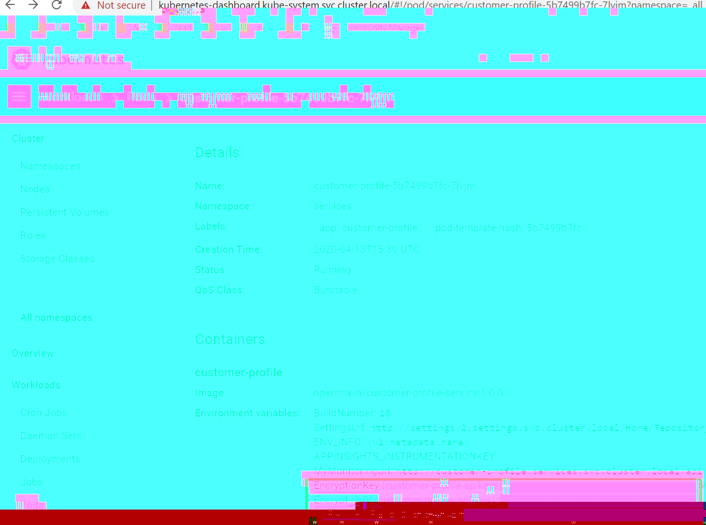

# MAVN.Service.CustomerProfile

# How to run
Read info https://github.com/OpenMAVN/Welcome/blob/master/how-to-run-backend.md

# How to run specifics
Add to `launchSettings.json` into section `environmentVariables` the fields from Kubernetes deployments which is accessible via VPN as shown on picture:  

